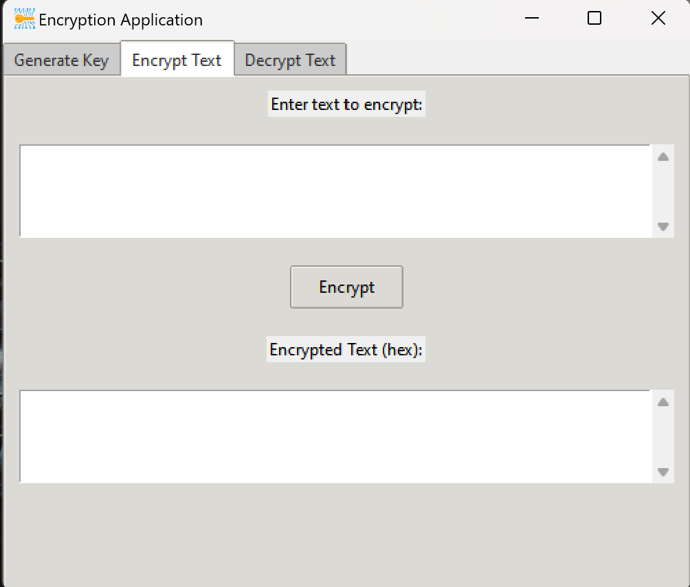
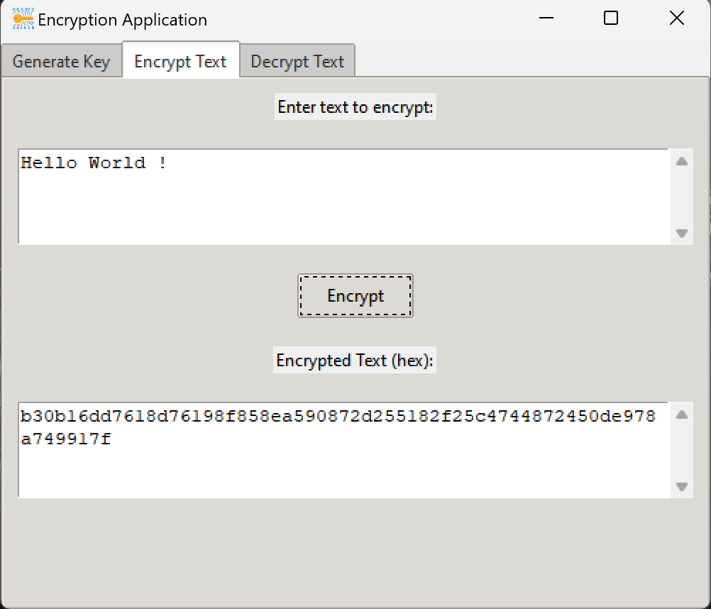
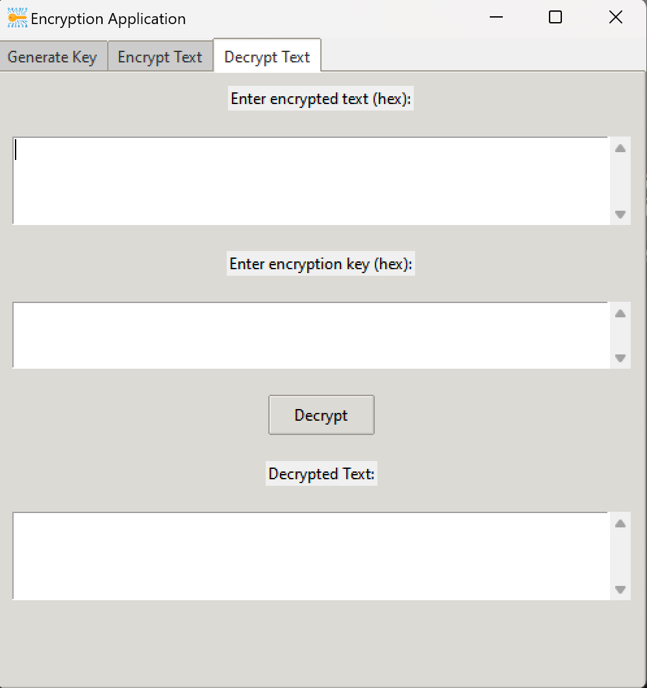
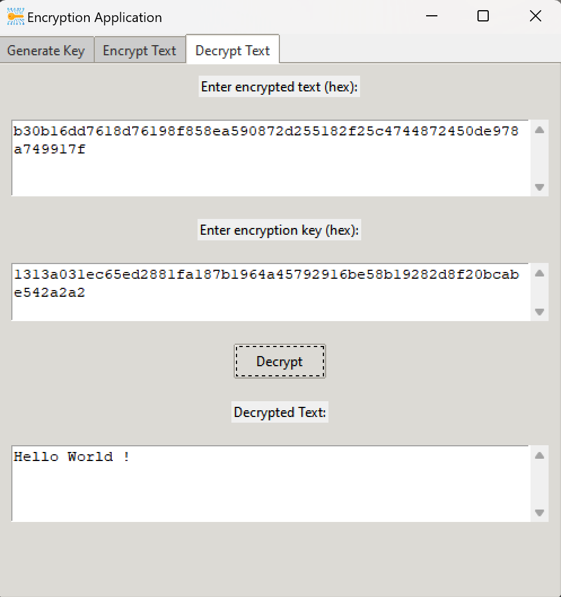

  

# About this project
Encryption Tool is a Python program that lets you encrypt text using the Encryption Library of Python. 
You can generate different keys so that a text is encrypted differently from another.

# How to use it 

  

 
This is the main page you get after executing the app; you have three tabs. The first one is to generate a key. After clicking on the "Generate Key" button, you will get this page with the generated key.   
  

    
     
  

 After this, to encrypt a text, go to the second tab called "Encrypt Text". You will be on this page:   
  

    
     
  

  After this, you can enter your text, press "Encrypt", and then you will have your encrypted text.  
    

    
  

  
   To decrypt a text, you will need the key you used to encrypt the text, and the encrypted text. Go to the third tab, the "Decrypt Text" tab.   

  

    

    
  

   
  Enter your key and encrypted text, and then press "Decrypt". You will get your decrypted text in no time!    

    

    
  

  
  # How to download
  [You can get the installer from here,](executable/Encryption_Tool_Installer.exe)
